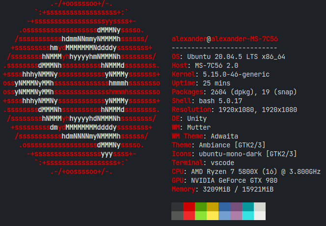

# speed-test
This repository contains a handful of different speed tests and preformance tests for a number of different programming languages. The purpose is to compare [Scope](https://github.com/ScopeLang/Scope) with a number of other programming languages, and to see which is the fastest in different scenarios. None of the tests are 100% optimized/efficient, and all aim to have the most generic code without the use of libraries to provide a similar experience for all programming languages.

All of the tests below were ran on the following machine:

Test results may differ on a different machines.

## Primes

Prints the 10,000th prime number (which is 104,729).

Pseudo code:
```
isPrime(n) {
	i = 2
	while (i < n) {
		if (n % i == 0) {
			ret false
		}
		i++
	}
	ret true
}

main() {
	n = 0
	p = 0
	while (p <= 10,000) {
		n++
		if (isPrime(n)) {
			p++
		}
	}
	
	println(n as string)
}
```

| **Language** | **Time**     |
|--------------|--------------|
| C            | 0.6 seconds  |
| **Scope**    | 1.9 seconds  |
| Python       | 23.5 seconds |